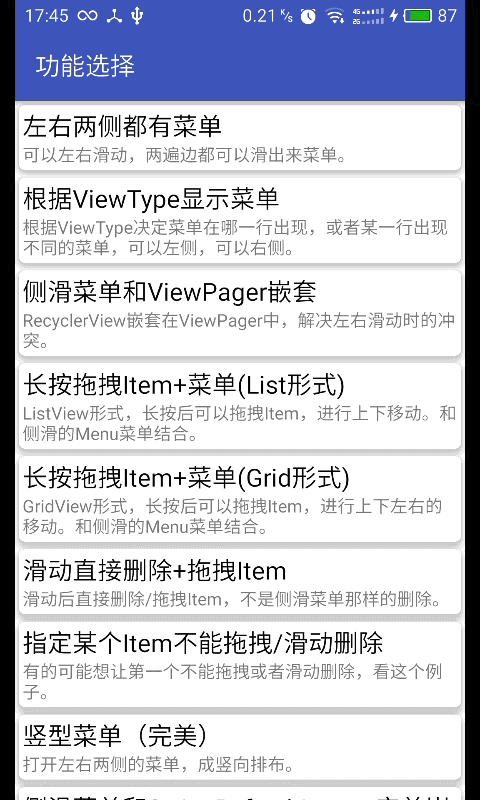
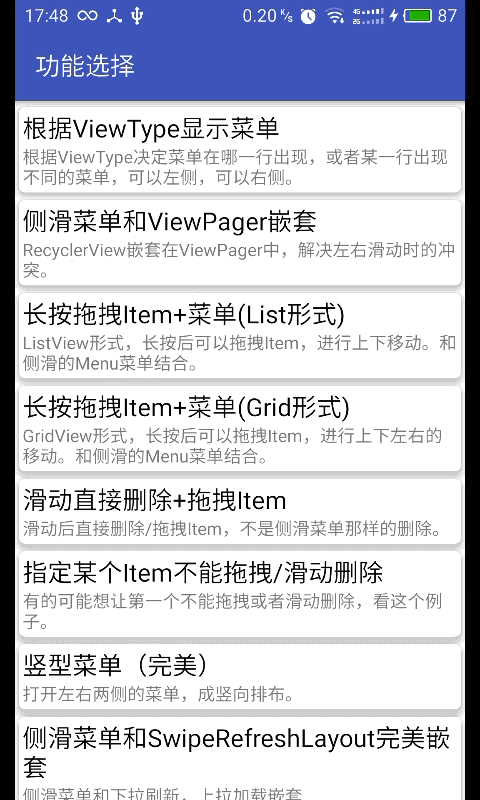
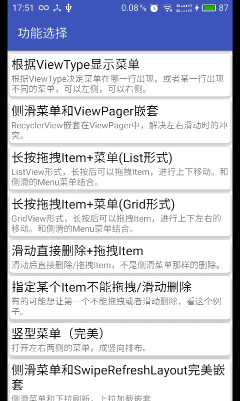
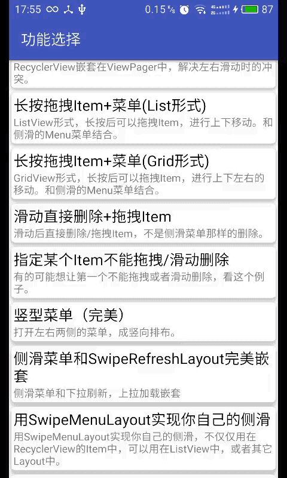
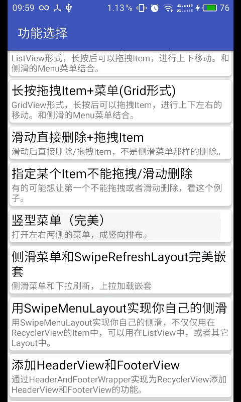
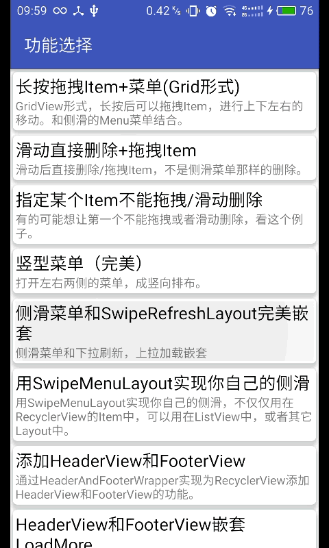
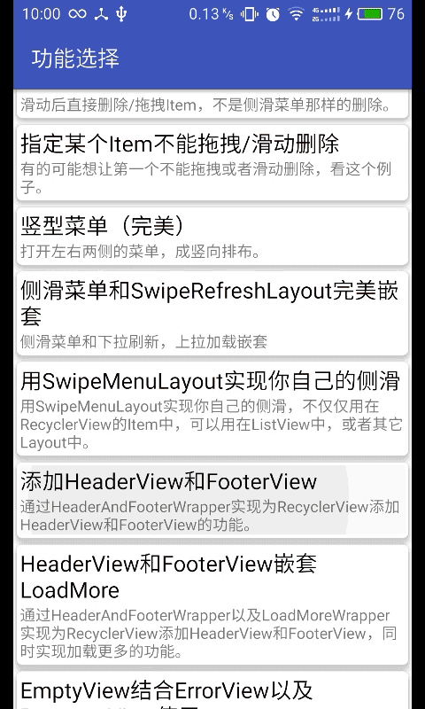
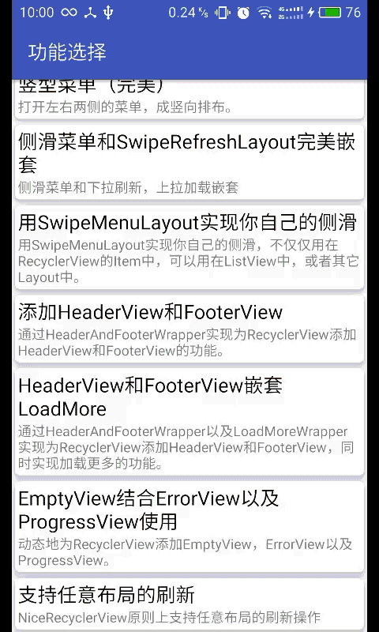
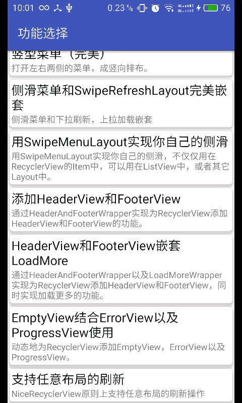
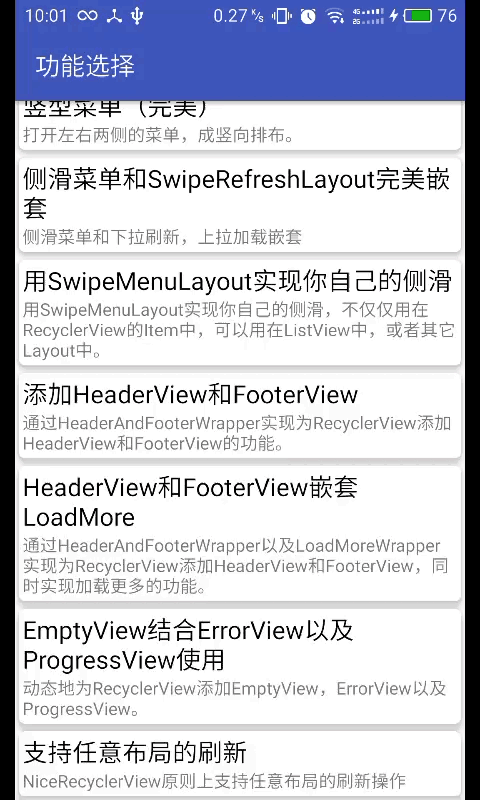

# NiceRecyclerView

一个针对

[EasyRecyclerView](https://github.com/Jude95/EasyRecyclerView)、

[BaseAdapter](https://github.com/hongyangAndroid/baseAdapter)、

[SwipeRecyclerView](https://github.com/yanzhenjie/SwipeRecyclerView)

的再次封装，方便开发安卓开发人员更简单地使用RecyclerView

## 先上一波效果图
    
不说话，先看图












看图可知，这个库的作用：

* 更加方便地构建RecyclerView的Adapter(构建CommonAdapter，熟悉鸿洋BaseAdapter库的同学应该知道怎么使用)
* 更加方便地为RecyclerView添加HeaderView和FooterView
* 完美地实现让RecyclerView具备下拉刷新和加载更多的功能
* 完美地为RecyclerView添加侧滑菜单，菜单的样式由开发人员来定
* 支持任意布局的刷新操作(严格意义上讲，NiceRecyclerView不是RecyclerView，它是对一些控件的包装)

## 引入

* AndroidStudio引入(Eclipse用户爱莫能助)
```
dependencies {
compile 'com.zcy:nicerecyclerview:1.0.0-bate'
   ...
}
 ```
 
## 用法

### xml中引入
```
 <com.zcy.nicerecyclerview.NiceRecyclerView
        android:id="@+id/recycler_view"
        android:layout_width="match_parent"
        android:layout_height="match_parent"
        app:layout_empty="@layout/view_empty"
        app:layout_error="@layout/view_error"
        app:layout_progress="@layout/view_progress" />
 ```
 
### 代码中调用
 ```
  NiceRecyclerView niceRecyclerView = (NiceRecyclerView) findViewById(R.id.recycler_view);
  CommonAdapter<String> adapter = new CommonAdapter<String>(context, R.layout.layout_item_allmenu, listData) {
              @Override
              protected void convert(ViewHolder holder, String s, int position) {
                  holder.setText(R.id.tv_title, s);
                  ImageView imageView = holder.getView(R.id.iv_icon);
                  Glide.with(mContext)
                          .load(R.mipmap.icon_moving)
                          .placeholder(R.mipmap.icon_moving)
                          .error(R.mipmap.icon_moving)
                          .crossFade(500)
                          .into(imageView);
              }
          };
        niceRecyclerView.setLayoutManager(new LinearLayoutManager(this));// 布局管理器。
        // niceRecyclerView.setHasFixedSize(true);// 如果Item够简单，高度是确定的，打开FixSize将提高性能。
        niceRecyclerView.setItemAnimator(new DefaultItemAnimator());// 设置Item默认动画，加也行，不加也行。
        // niceRecyclerView.addItemDecoration(new DividerDecoration(
        // context.getResources().getColor(R.color.purple_pressed), 2));// 添加分割线。
        // 为niceRecyclerView的Item创建菜单就两句话，不错就是这么简单：
        // 设置菜单创建器。
        niceRecyclerView.setSwipeMenuCreator(swipeMenuCreator);
        // 设置菜单Item点击监听。
        niceRecyclerView.setSwipeMenuItemClickListener(menuItemClickListener);
        niceRecyclerView.setAdapter(adapter);
  ```      
其中，R.layout.layout_item_allmenu为Item的布局文件，listData为数据集，
swipeMenuCreator为菜单创建器，menuItemClickListener为菜单单击事件

### 创建菜单
```
   /**
     * 菜单创建器。在Item要创建菜单的时候调用。
     */
    private SwipeMenuCreator swipeMenuCreator = new SwipeMenuCreator() {
        @Override
        public void onCreateMenu(SwipeMenu swipeLeftMenu, SwipeMenu swipeRightMenu, int viewType) {
            int width = getResources().getDimensionPixelSize(R.dimen.item_height);

            // MATCH_PARENT 自适应高度，保持和内容一样高；也可以指定菜单具体高度，也可以用WRAP_CONTENT。
            int height = ViewGroup.LayoutParams.MATCH_PARENT;

            // 添加左侧的，如果不添加，则左侧不会出现菜单。
            {
                SwipeMenuItem addItem = new SwipeMenuItem(context)
                        .setBackgroundDrawable(R.drawable.selector_green)// 点击的背景。
                        .setImage(R.mipmap.ic_action_add) // 图标。
                        .setWidth(width) // 宽度。
                        .setHeight(height); // 高度。
                swipeLeftMenu.addMenuItem(addItem); // 添加一个按钮到左侧菜单。

                SwipeMenuItem closeItem = new SwipeMenuItem(context)
                        .setBackgroundDrawable(R.drawable.selector_red)
                        .setImage(R.mipmap.ic_action_close)
                        .setWidth(width)
                        .setHeight(height);

                swipeLeftMenu.addMenuItem(closeItem); // 添加一个按钮到左侧菜单。
            }

            // 添加右侧的，如果不添加，则右侧不会出现菜单。
            {
                SwipeMenuItem deleteItem = new SwipeMenuItem(context)
                        .setBackgroundDrawable(R.drawable.selector_red)
                        .setImage(R.mipmap.ic_action_delete)
                        .setText("删除") // 文字，还可以设置文字颜色，大小等。。
                        .setTextColor(Color.WHITE)
                        .setWidth(width)
                        .setHeight(height);
                swipeRightMenu.addMenuItem(deleteItem);// 添加一个按钮到右侧侧菜单。

                SwipeMenuItem closeItem = new SwipeMenuItem(context)
                        .setBackgroundDrawable(R.drawable.selector_purple)
                        .setImage(R.mipmap.ic_action_close)
                        .setWidth(width)
                        .setHeight(height);
                swipeRightMenu.addMenuItem(closeItem); // 添加一个按钮到右侧菜单。

                SwipeMenuItem addItem = new SwipeMenuItem(context)
                        .setBackgroundDrawable(R.drawable.selector_green)
                        .setText("添加")
                        .setTextColor(Color.WHITE)
                        .setWidth(width)
                        .setHeight(height);
                swipeRightMenu.addMenuItem(addItem); // 添加一个按钮到右侧菜单。
            }
        }
    };
```    

### 菜单点击事件监听
```
   /**
     * 菜单点击监听。
     */
    private OnSwipeMenuItemClickListener menuItemClickListener = new OnSwipeMenuItemClickListener() {
        /**
         * Item的菜单被点击的时候调用。
         * @param closeable       closeable. 用来关闭菜单。
         * @param adapterPosition adapterPosition. 这个菜单所在的item在Adapter中position。
         * @param menuPosition    menuPosition. 这个菜单的position。比如你为某个Item创建了2个MenuItem，那么这个position可能是是 0、1，
         * @param direction       如果是左侧菜单，值是：SwipeMenuRecyclerView#LEFT_DIRECTION，如果是右侧菜单，值是：SwipeMenuRecyclerView#RIGHT_DIRECTION.
         */
        @Override
        public void onItemClick(Closeable closeable, int adapterPosition, int menuPosition, int direction) {
            closeable.smoothCloseMenu();// 关闭被点击的菜单。

            if (direction == SwipeMenuRecyclerView.RIGHT_DIRECTION) {
                Toast.makeText(context, "当前列表第" + (adapterPosition + 1) + "项; " +
                        "右侧" + (menuPosition + 1) + "个菜单", Toast.LENGTH_SHORT).show();
                if (menuPosition == 0) {// 删除按钮被点击。
                    listData.remove(adapterPosition);
                    // TODO: 16/10/7  注意此时移除的操作,需要交给SuperRecyclerView自身来处理
                    niceRecyclerView.notifyItemRemoved(adapterPosition);
                }
            } else if (direction == SwipeMenuRecyclerView.LEFT_DIRECTION) {
                Toast.makeText(context, "当前列表第" + (adapterPosition + 1) + "项;" +
                        " 左侧第" + (menuPosition + 1) + "个菜单", Toast.LENGTH_SHORT).show();
            }
        }
    };
```    

### Item点击和长按事件监听

```
 adapter.setOnItemClickListener(new MultiItemTypeAdapter.OnItemClickListener() {
            @Override
            public void onItemClick(View view, RecyclerView.ViewHolder holder, int position) {
                Toast.makeText(context, "您点击了当前列表中的第" + (position + 1) + "个栏目", Toast.LENGTH_SHORT).show();
            }

            @Override
            public boolean onItemLongClick(View view, RecyclerView.ViewHolder holder, int position) {
                Toast.makeText(context, "来和妲己玩耍吧", Toast.LENGTH_SHORT).show();
                // TODO: 2016/10/8 为了不干扰单击事件，让长按的事件返回true
                return true;
            }
        });
```

### 开启Item的滑动删除以及长按拖拽功能

```
        niceRecyclerView.setLongPressDragEnabled(true);// 开启长按拖拽。
        niceRecyclerView.setItemViewSwipeEnabled(true);// 开启滑动删除。
        niceRecyclerView.setOnItemMoveListener(onItemMoveListener);// 监听拖拽，更新UI。
        niceRecyclerView.setOnItemMovementListener(onItemMovementListener);
```

```
   /**
     * 当Item移动的时候。
     */
    private OnItemMoveListener onItemMoveListener = new OnItemMoveListener() {
        @Override
        public boolean onItemMove(int fromPosition, int toPosition) {
            if (toPosition == 0) {// 保证第一个不被挤走。
                return false;
            }
            Collections.swap(listData, fromPosition, toPosition);
            niceRecyclerView.notifyItemMoved(fromPosition, toPosition);
            return true;
        }

        @Override
        public void onItemDismiss(int position) {
            listData.remove(position);
            niceRecyclerView.notifyItemRemoved(position);
            Toast.makeText(context, "当前列表的第" + (position + 1) + "条被删除。", Toast.LENGTH_SHORT).show();
        }
    };
```

```
   /**
     * 当Item被移动之前。
     */
    public static OnItemMovementListener onItemMovementListener = new OnItemMovementListener() {
        /**
         * 当Item在移动之前，获取拖拽的方向。
         * @param recyclerView     {@link RecyclerView}.
         * @param targetViewHolder target ViewHolder.
         * @return
         */
        @Override
        public int onDragFlags(RecyclerView recyclerView, RecyclerView.ViewHolder targetViewHolder) {
            // 我们让第一个不能拖拽。
            if (targetViewHolder.getAdapterPosition() == 0) {
                return OnItemMovementListener.INVALID;// 返回无效的方向。
            }

            RecyclerView.LayoutManager layoutManager = recyclerView.getLayoutManager();
            if (layoutManager instanceof LinearLayoutManager) {// 如果是LinearLayoutManager。
                LinearLayoutManager linearLayoutManager = (LinearLayoutManager) layoutManager;
                if (linearLayoutManager.getOrientation() == LinearLayoutManager.HORIZONTAL) {// 横向的List。
                    return (OnItemMovementListener.LEFT | OnItemMovementListener.RIGHT); // 只能左右拖拽。
                } else {// 竖向的List。
                    return OnItemMovementListener.UP | OnItemMovementListener.DOWN; // 只能上下拖拽。
                }
            } else if (layoutManager instanceof GridLayoutManager) {// 如果是Grid。
                return OnItemMovementListener.LEFT | OnItemMovementListener.RIGHT | OnItemMovementListener.UP | OnItemMovementListener.DOWN; // 可以上下左右拖拽。
            }
            return OnItemMovementListener.INVALID;// 返回无效的方向。
        }

        @Override
        public int onSwipeFlags(RecyclerView recyclerView, RecyclerView.ViewHolder targetViewHolder) {
            // 我们让第一个不能滑动删除。
            if (targetViewHolder.getAdapterPosition() == 0) {
                return OnItemMovementListener.INVALID;// 返回无效的方向。
            }

            RecyclerView.LayoutManager layoutManager = recyclerView.getLayoutManager();
            if (layoutManager instanceof LinearLayoutManager) {// 如果是LinearLayoutManager
                LinearLayoutManager linearLayoutManager = (LinearLayoutManager) layoutManager;
                if (linearLayoutManager.getOrientation() == LinearLayoutManager.HORIZONTAL) {// 横向的List。
                    return OnItemMovementListener.UP | OnItemMovementListener.DOWN; // 只能上下滑动删除。
                } else {// 竖向的List。
                    return OnItemMovementListener.LEFT | OnItemMovementListener.RIGHT; // 只能左右滑动删除。
                }
            }
            return OnItemMovementListener.INVALID;// 其它均返回无效的方向。
        }
    };
```

### 添加HeaderView和FooterView

```
        // TODO: 2016/10/5  添加头部或者尾部View使用以下方式
        // 添加头部view1
        View header1 = LayoutInflater.from(context).inflate(R.layout.view_header, null);
        niceRecyclerView.addHeaderView(header1);
        // 添加头部view2
        View header2 = LayoutInflater.from(context).inflate(R.layout.view_largeheader, null);
        niceRecyclerView.addHeaderView(header2);
        // 添加尾部view
        View footer = LayoutInflater.from(context).inflate(R.layout.view_footer, null);
        niceRecyclerView.addFooterView(footer);
```

### 添加下拉刷新功能

```
niceRecyclerView.setRefreshListener(new SwipeRefreshLayout.OnRefreshListener() {
            @Override
            public void onRefresh() {

                handler.postDelayed(new Runnable() {
                    @Override
                    public void run() {
                        runOnUiThread(new Runnable() {
                            @Override
                            public void run() {
                                Toast.makeText(context, "数据刷新完成", Toast.LENGTH_SHORT).show();
                                niceRecyclerView.setRefreshing(false);
                                initData();
                                // TODO: 2016/10/6  刷新页面数据需调用以下方法
                                adapter.setDatas(listData);
                                niceRecyclerView.notifyDataSetChanged();
                            }
                        });
                    }
                }, 5000);
            }
        });
```

### 添加加载更多功能

```
 niceRecyclerView.addLoadMoreView(R.layout.view_loadmore);
 niceRecyclerView.setOnLoadMoreListener(new LoadMoreWrapper.OnLoadMoreListener() {
             @Override
             public void onLoadMoreRequested() {
                 Toast.makeText(context, "正在加载更多数据", Toast.LENGTH_SHORT).show();
                 handler.postDelayed(new Runnable() {
                     @Override
                     public void run() {
                         runOnUiThread(new Runnable() {
                             @Override
                             public void run() {
                                 listData.addAll(getNewData());
                                 adapter.setDatas(listData);
                                 niceRecyclerView.notifyDataSetChanged();
                             }
                         });
                     }
                 }, 5000);
             }
         });
```

### CommAdapter支持多布局

```
 adapter = new CommonAdapter<ViewTypeBean>(context, R.layout.layout_item_allmenu, listData) {
            @Override
            protected void convert(ViewHolder holder, ViewTypeBean viewTypeBean, int position) {
                holder.setText(R.id.tv_title, viewTypeBean.getContent());
                ImageView imageView = holder.getView(R.id.iv_icon);
                Glide.with(context)
                        .load(R.mipmap.icon_moving)
                        .placeholder(R.mipmap.icon_moving)
                        .error(R.mipmap.icon_moving)
                        .crossFade(500)
                        .into(imageView);
            }
        };
        // TODO: 2016/10/5 多个ViewType建议下面这样写（如果你要使用CommonAdapter的话）
        adapter.addItemViewDelegate(SwipeMenuAdapter.VIEW_TYPE_MENU_LEFT, new ItemViewDelegate<ViewTypeBean>() {
            @Override
            public int getItemViewLayoutId() {
                return layout_item_allmenu;
            }

            @Override
            public boolean isForViewType(ViewTypeBean item, int position) {
                return item.getViewType() == SwipeMenuAdapter.VIEW_TYPE_MENU_LEFT;
            }

            @Override
            public void convert(ViewHolder holder, ViewTypeBean viewTypeBean, int position) {
                // TODO: 2016/10/11  如果界面不同请复写该方法
            }
        });
        adapter.addItemViewDelegate(SwipeMenuAdapter.VIEW_TYPE_MENU_MULTI, new ItemViewDelegate<ViewTypeBean>() {
            @Override
            public int getItemViewLayoutId() {
                return layout_item_allmenu;
            }

            @Override
            public boolean isForViewType(ViewTypeBean item, int position) {
                return item.getViewType() == SwipeMenuAdapter.VIEW_TYPE_MENU_MULTI;
            }

            @Override
            public void convert(ViewHolder holder, ViewTypeBean viewTypeBean, int position) {
                // TODO: 2016/10/11  如果界面不同请复写该方法
            }
        });
        adapter.addItemViewDelegate(SwipeMenuAdapter.VIEW_TYPE_MENU_NONE, new ItemViewDelegate<ViewTypeBean>() {
            @Override
            public int getItemViewLayoutId() {
                return layout_item_allmenu;
            }

            @Override
            public boolean isForViewType(ViewTypeBean item, int position) {
                return item.getViewType() == SwipeMenuAdapter.VIEW_TYPE_MENU_NONE;
            }

            @Override
            public void convert(ViewHolder holder, ViewTypeBean viewTypeBean, int position) {
                // TODO: 2016/10/11  如果界面不同请复写该方法
            }
        });
        adapter.addItemViewDelegate(SwipeMenuAdapter.VIEW_TYPE_MENU_SINGLE, new ItemViewDelegate<ViewTypeBean>() {
            @Override
            public int getItemViewLayoutId() {
                return layout_item_allmenu;
            }

            @Override
            public boolean isForViewType(ViewTypeBean item, int position) {
                return item.getViewType() == SwipeMenuAdapter.VIEW_TYPE_MENU_SINGLE;
            }

            @Override
            public void convert(ViewHolder holder, ViewTypeBean viewTypeBean, int position) {
                // TODO: 2016/10/11  如果界面不同请复写该方法
            }
        });
 niceRecyclerView.setAdapter(adapter);
```

### 支持ProgressView、EmptyView、ErrorView

* 布局文件添加
```
 app:layout_empty="@layout/view_empty"
 app:layout_error="@layout/view_error"
 app:layout_progress="@layout/view_progress"
```
* 或者代码中添加(效果同上)
```
 niceRecyclerView.setEmptyView(emptyView);
 niceRecyclerView.setProgressView(progressView);
 niceRecyclerView.setErrorView(errorView);
 ```
* 根据自己的界面逻辑，让NiceRecyclerView显示不同的界面
niceRecyclerView.showEmpty();   or   niceRecyclerView.showProgress();   or   
niceRecyclerView.showError();    or  niceRecyclerView.showRecycler();

## 使用注意事项

NiceRecyclerView并不是RecyclerView，它是一系列控件的封装，
使用NiceRecyclerView通知界面重绘时不能使用它的Adapter来完成，
而应该通过调用niceRecyclerView.notifyItemRemoved(position);
niceRecyclerView.notifyItemMoved(fromPosition, toPosition);
niceRecyclerView.notifyDataSetChanged();
等一系列这样的api来完成，即以前adapter的工作现
在交给niceRecyclerView自己来完成
具体使用请参考sample中的示例                                      

## 写在最后

* NiceRecyclerView中的源码并非原创，只是将大神们功能较全的代码做了整合，方便调用

* 感谢大神们
1. [张鸿洋](http://blog.csdn.net/lmj623565791/)
2. [严振杰](http://blog.csdn.net/yanzhenjie1003/)                                    
3. [Jude95](http://www.jianshu.com/users/d73c34b951ef/latest_articles)                                   
                                        